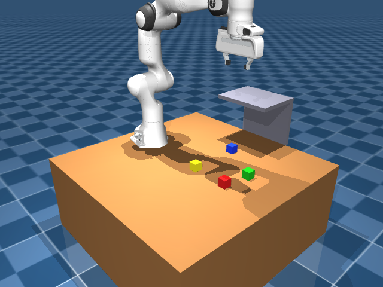
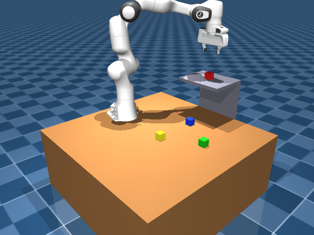

# robotic-arm

A voice-ready robotic manipulator controlled by natural language — an NLP agent drives a Franka Panda arm in MuJoCo physics simulation to pick and place colored boxes.


## Overview

`robotic-arm` lets you control a 7-DOF Franka Panda manipulator by speaking (or typing) plain English. A natural-language agent parses commands like *"put the green box on the shelf"*, plans the motion, and executes pick-and-place in a physics simulation with differential inverse kinematics.

The workspace contains four colored cubes (red, green, blue, yellow) on a table and an elevated shelf. The agent uses tool calling — look, find, pick, place — backed by NVIDIA NIM (`google/gemma-4-31b-it`) for ambiguous requests, with a fast local parser for common commands (no API call needed).

## Demo

| Initial scene | After pick & place |
|:---:|:---:|
|  |  |

**Example session** (CLI):

```
> put the green box on the shelf
agent: understood (local)
  [tool call] pick({'object_name': 'green'})
  [tool result] Picked up the green box; it is now held at z=0.614.
  [tool call] place({'location_name': 'shelf'})
  [tool result] Placed the held box on a free spot on the shelf and released it.
```

## Features

- **MuJoCo simulation** — Franka Panda with parallel-jaw gripper, table, shelf, and four free-floating colored boxes
- **Natural-language control** — type or speak instructions; agent maps them to pick/place tool calls
- **Dual-camera perception** — external 3/4 view and wrist-mounted camera for vision queries via NVIDIA NIM
- **Differential IK** — smooth end-effector motion via [mink](https://github.com/kevinzakka/mink) (DLS fallback if unavailable)
- **Reliable grasping** — weld constraint between gripper and object (no reliance on friction)
- **Chat UI** — Tkinter window with live camera feeds and instruction history

## Architecture

```
User instruction (text / voice)
        │
        ▼
┌───────────────────┐
│  Agent (agent.py) │  local regex fast-path OR NVIDIA NIM tool calling
└─────────┬─────────┘
          │ pick / place / find_object / look_at_scene
          ▼
┌───────────────────┐
│ Skills (skills.py)│  high-level manipulation primitives
└─────────┬─────────┘
          │
          ▼
┌───────────────────┐
│  SimEnv (sim_env) │  MuJoCo physics + IK + passive viewer
└───────────────────┘
```

1. **Listen** — capture audio and transcribe to text *(planned for hardware)*
2. **Understand** — parse text into structured tool calls (pick, place, look)
3. **Plan** — IK generates joint trajectories to target poses
4. **Act** — gripper closes, weld engages, arm lifts and places on shelf

## Tech stack

| Layer | Technology |
|-------|------------|
| Language | Python 3.10+ |
| Simulation | [MuJoCo](https://mujoco.org/) 3.x |
| Robot model | Franka Panda (MuJoCo Menagerie meshes) |
| IK | mink (preferred) or damped least-squares fallback |
| NLP / vision | NVIDIA NIM — `google/gemma-4-31b-it` via LangChain |
| UI | Tkinter + Pillow live camera feeds |

## Getting started

### Prerequisites

- Python 3.10 or newer
- NVIDIA API key ([build.nvidia.com](https://build.nvidia.com)) — only required for ambiguous commands and vision; common pick/place phrases work offline via the local parser

### Install

```bash
git clone https://github.com/Bhavya007-17/robotic-arm.git
cd robotic-arm
python -m venv venv

# Windows
venv\Scripts\activate
# macOS / Linux
source venv/bin/activate

pip install -r requirements.txt
```

### Configure

```bash
# Windows PowerShell
$env:NVIDIA_API_KEY = "nvapi-..."

# macOS / Linux
export NVIDIA_API_KEY="nvapi-..."
```

### Run

**Interactive CLI** — type instructions in the terminal:

```bash
python agent.py
```

**Chat UI** — graphical window with live cameras:

```bash
python chat_ui.py
```

**Headless demo** — capture screenshots (used for this README):

```bash
python capture_demo.py
```

**Smoke test** — verify pick-and-place without the agent:

```bash
python skills.py
```

### Example commands

| Command | Behavior |
|---------|----------|
| `pick up red box` | Grasp the red cube |
| `put the green box on the shelf` | Pick green, place on shelf |
| `place it on the shelf` | Place currently held object |
| `what do you see?` | Vision query via NVIDIA NIM (requires API key) |

## Repository layout

```
agent.py          # NLP agent + tool definitions + NVIDIA NIM integration
chat_ui.py        # Tkinter chat interface with live camera feeds
sim_env.py        # MuJoCo environment, IK, viewer
skills.py         # pick / place / find_object manipulation skills
capture_demo.py   # Headless demo script for README screenshots
models/           # Panda URDF/XML + mesh assets + scene definition
docs/images/      # Simulation screenshots
requirements.txt
```

## Status

**Working simulation** — pick-and-place of all four colored boxes onto the shelf via natural-language commands. Voice input and physical hardware integration are planned next.

## Roadmap

- [x] MuJoCo scene with Franka Panda + colored boxes + shelf
- [x] Differential IK motion planning
- [x] Pick-and-place skills with weld-based grasping
- [x] NLP agent with tool calling (NVIDIA NIM + local fast-path)
- [x] Chat UI with dual-camera feeds
- [ ] Speech-to-text for voice input
- [ ] ROS 2 bridge for physical arm deployment
- [ ] End-to-end demo video

## License

MIT — see the [LICENSE](LICENSE) file.

## Contact

Bhavya Dosi — [LinkedIn](https://www.linkedin.com/in/bhavya-dosi)
