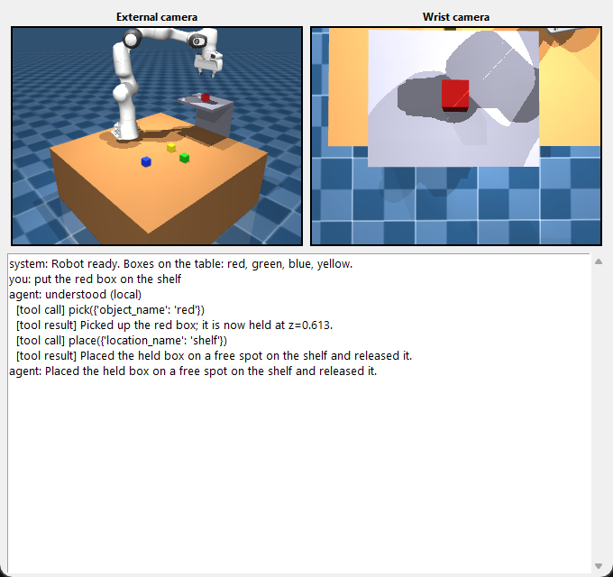
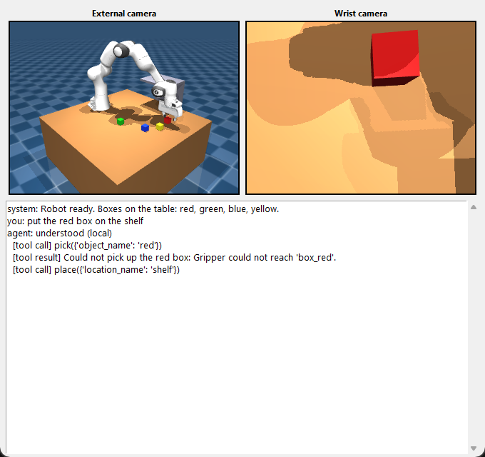
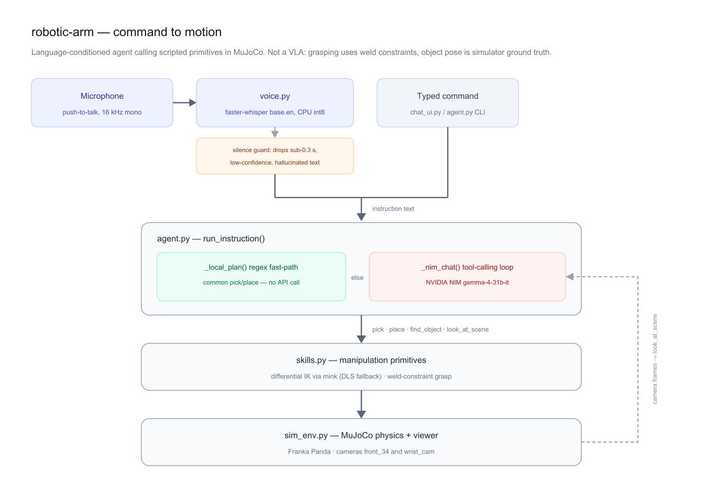

# robotic-arm

A voice-controlled robotic manipulator **in simulation** — speak a command, and a language-conditioned agent drives a Franka Panda arm in MuJoCo to pick and place colored boxes. Speech-to-text runs locally on the CPU.


-8A2BE2)


## Overview

`robotic-arm` lets you control a 7-DOF Franka Panda manipulator by speaking or typing plain English. Hold the mic button, say *"put the green box on the shelf"*, and the agent transcribes it, plans the motion, and executes pick-and-place with differential inverse kinematics.

The workspace contains four colored cubes (red, green, blue, yellow) on a table and an elevated shelf. The agent uses tool calling — look, find, pick, place — backed by NVIDIA NIM (`google/gemma-4-31b-it`) for ambiguous requests, with a fast local parser for common commands (no API call needed).

### What this is, and what it is not

Being precise, because these distinctions matter:

- **It is** a language-conditioned agent that calls scripted manipulation primitives, with local speech-to-text on the front.
- **It is not** a Vision-Language-Action model. Grasping uses a MuJoCo weld constraint rather than contact friction, and object pose is read as simulator ground truth rather than perceived.
- **It is simulation only.** There is no physical arm. Voice control is real; the hardware is not.

## Demo

Screenshots captured by `python capture_demo.py` — a headless pick-and-place run that saves frames from both cameras at each stage.

### Pick & place workflow

| Initial scene | Holding red box | Red box on shelf |
|:---:|:---:|:---:|
|  |  |  |

### Dual-camera views

The simulation exposes two MuJoCo cameras used by the agent, chat UI, and screenshot script:

| Camera | View | Defined in | Used by |
|--------|------|------------|---------|
| `front_34` | Fixed 3/4 external view of the full workspace | `models/scene.xml` | `agent.py`, `chat_ui.py`, `capture_demo.py` |
| `wrist_cam` | First-person view from the gripper | `models/panda.xml` | `agent.py`, `chat_ui.py`, `capture_demo.py` |

**External camera (`front_34`)** — wide workspace overview for scene understanding and monitoring motion:

| Before pick | After place |
|:---:|:---:|
|  |  |

**Wrist camera (`wrist_cam`)** — close-up gripper view for grasp alignment and object identification:

| Before pick | After place |
|:---:|:---:|
|  |  |

Camera definitions in the scene files:

```xml
<!-- models/scene.xml — fixed external 3/4 view -->
<camera name="front_34" pos="1.4 -1.0 1.2" xyaxes="0.673 0.740 0 -0.315 0.287 0.905"/>

<!-- models/panda.xml — mounted on the gripper hand -->
<camera name="wrist_cam" pos="0.07 0 0.03" xyaxes="0 -1 0 -1 0 0" fovy="75"/>
```

**Example session** (CLI):

```
> put the red box on the shelf
agent: understood (local)
  [tool call] pick({'object_name': 'red'})
  [tool result] Picked up the red box; it is now held at z=0.614.
  [tool call] place({'location_name': 'shelf'})
  [tool result] Placed the held box on a free spot on the shelf and released it.
```

### Chat UI

`chat_ui.py` — live camera feeds, push-to-talk mic, and the full tool-call transcript:



Failures are kept rather than hidden. `randomize_boxes()` sometimes places a cube outside the arm's reachable workspace, and the agent reports it instead of silently retrying:



## Features

- **MuJoCo simulation** — Franka Panda with parallel-jaw gripper, table, shelf, and four free-floating colored boxes
- **Local voice input** — push-to-talk speech-to-text via [faster-whisper](https://github.com/SYSTRAN/faster-whisper) on the CPU; no cloud speech service, no GPU
- **Natural-language control** — type or speak instructions; agent maps them to pick/place tool calls
- **Dual-camera perception** — external 3/4 view and wrist-mounted camera for vision queries via NVIDIA NIM
- **Differential IK** — smooth end-effector motion via [mink](https://github.com/kevinzakka/mink) (DLS fallback if unavailable)
- **Reliable grasping** — weld constraint between gripper and object (no reliance on friction)
- **Chat UI** — Tkinter window with live camera feeds and instruction history

## Architecture



1. **Listen** — hold the mic button; `voice.py` records at 16 kHz and transcribes locally with faster-whisper
2. **Understand** — parse text into structured tool calls (pick, place, look)
3. **Plan** — IK generates joint trajectories to target poses
4. **Act** — gripper closes, weld engages, arm lifts and places on shelf

### Voice input

Push-to-talk, deliberately — no wake word, and nothing is streamed anywhere. Audio never leaves the machine.

Whisper hallucinates on near-silence, emitting training-data artifacts like `"Thank you."` or `"you"`. Sending those to a robot arm as commands is not acceptable, so a transcript is discarded unless it clears three gates: at least 0.3 s of audio, per-segment `no_speech_prob ≤ 0.6` and `avg_logprob ≥ -1.0`, and no match against a known-hallucination blocklist. A rejected transcript is never queued.

Measured on an Intel Core Ultra 9, CPU only, `base.en` with `int8` quantisation: **0.53 s to transcribe 2.61 s of speech — 5.0x realtime**, with a one-time 6.6 s model load at startup. Set `WHISPER_MODEL=small.en` for better accuracy at roughly a third of the speed.

## Tech stack

| Layer | Technology |
|-------|------------|
| Language | Python 3.10+ |
| Speech-to-text | [faster-whisper](https://github.com/SYSTRAN/faster-whisper) `base.en`, CPU int8 |
| Audio capture | [sounddevice](https://python-sounddevice.readthedocs.io/) — 16 kHz mono |
| Simulation | [MuJoCo](https://mujoco.org/) 3.x |
| Robot model | Franka Panda (MuJoCo Menagerie meshes) |
| IK | mink (preferred) or damped least-squares fallback |
| NLP / vision | NVIDIA NIM — `google/gemma-4-31b-it` via LangChain |
| UI | Tkinter + Pillow live camera feeds |

## Getting started

### Prerequisites

- Python 3.10 or newer
- A working microphone, for voice input
- NVIDIA API key ([build.nvidia.com](https://build.nvidia.com)) — only required for ambiguous commands and vision; common pick/place phrases work offline via the local parser, and the app starts without a key

The Whisper model (~140 MB for `base.en`) downloads automatically on first run and is cached afterwards.

### Install

```bash
git clone https://github.com/Bhavya007-17/robotic-arm.git
cd robotic-arm
python -m venv venv

# Windows
venv\Scripts\activate
# macOS / Linux
source venv/bin/activate

pip install -r requirements.txt
```

### Configure

```bash
# Windows PowerShell
$env:NVIDIA_API_KEY = "nvapi-..."

# macOS / Linux
export NVIDIA_API_KEY="nvapi-..."
```

### Run

**Interactive CLI** — type instructions in the terminal:

```bash
python agent.py
```

**Chat UI** — graphical window with live cameras and push-to-talk voice:

```bash
python chat_ui.py
```

Hold **🎤 Hold to talk**, speak, release. The status line reports what happened; voice commands appear in the history tagged `you (voice):`.

**Voice smoke test** — record three seconds and print the transcript with timings:

```bash
python voice.py --smoke
```

**Headless demo** — capture the camera frames used in this README:

```bash
python capture_demo.py
```

**UI screenshot** — launch the chat window, run a command, grab the window:

```bash
python capture_ui.py
```

**Smoke test** — verify pick-and-place without the agent:

```bash
python skills.py
```

**Tests**:

```bash
python -m pytest test_voice.py -q
```

### Example commands

| Command | Behavior |
|---------|----------|
| `pick up red box` | Grasp the red cube |
| `put the green box on the shelf` | Pick green, place on shelf |
| `place it on the shelf` | Place currently held object |
| `what do you see?` | Vision query via NVIDIA NIM (requires API key) |

## Repository layout

```
agent.py          # NLP agent + tool definitions + NVIDIA NIM integration
voice.py          # Local speech-to-text (faster-whisper) + silence guard
chat_ui.py        # Tkinter chat interface with live camera feeds + push-to-talk
sim_env.py        # MuJoCo environment, IK, viewer
skills.py         # pick / place / find_object manipulation skills
capture_demo.py   # Headless demo script for README screenshots
capture_ui.py     # Launches the chat UI and screenshots the window
test_voice.py     # Tests for the voice front-end
models/           # Panda URDF/XML + mesh assets + scene definition
docs/images/      # Simulation screenshots + architecture diagram
requirements.txt
```

## Status

**Working simulation** — spoken or typed commands drive pick-and-place of all four colored boxes onto the shelf. Speech-to-text runs locally. Physical hardware integration is not started: there is no arm, and nothing here has run outside simulation.

## Roadmap

- [x] MuJoCo scene with Franka Panda + colored boxes + shelf
- [x] Differential IK motion planning
- [x] Pick-and-place skills with weld-based grasping
- [x] NLP agent with tool calling (NVIDIA NIM + local fast-path)
- [x] Chat UI with dual-camera feeds
- [x] Speech-to-text for voice input (local faster-whisper, push-to-talk)
- [ ] ROS 2 bridge for physical arm deployment
- [ ] End-to-end demo video

## License

MIT — see the [LICENSE](LICENSE) file.

## Contact

Bhavya Dosi — [LinkedIn](https://www.linkedin.com/in/bhavya-dosi)
